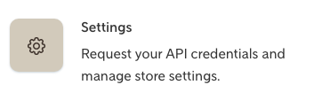
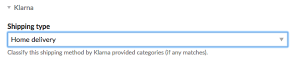
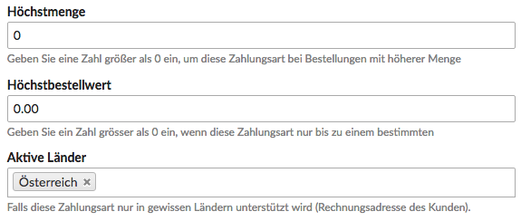

Documentation
=============

Klarna Checkout v3 for Isotope eCommerce.

You need to request Klarna Checkout in the version 3. You know that you're on the right path if you can login to the Merchant Portal linked below.

Configuration
-------------

Follow the manual from top to down.

### Shop Configuration

Enable the Klarna checkout in any shop configuration in use.

Go to the Klarna Merchant Portal <https://eu.portal.klarna.com> and generate the API credentials (username-password pair) within the "Settings" section.

### Shipping Methods

Shipping type: Select the category that describes your shipping method the best.

### Payment Methods

This checkout also supports External Payment Methods.

An external payment method is every payment method not implemented in the Klarna checkout, such as PayPal.

Every payment method should work, even such who are of type "PostSale" and redirect back to the Shop in order to verify the payment (such as PayPal Standard Checkout).

Note that for orders being placed with an external payment method no Klarna order will be created and the order confirmation page will differ. There will no Klarna iFrame get loaded.

### Taxes

The taxes which apply to the cart will transmitted to the Klarna API.

Make sure to configure the tax settings properly: <https://isotopeecommerce.org/de/handbuch/v/2.4/r/steuersaetze.html>

Due to the requirements of the Klarna API, the extension calculates the absolute amount of taxes that apply for every product and shipping method to make it work.

In case you have rules that add discount to the cart items (not to the cart subtotal), the discount gets added for every product. The rule then does not show up as surcharge in the cart.

### Module: Klarna Checkout

Create a module of type "Klarna Checkout".

#### Redirects:
Select the pages of your Shop, such as page containing the "terms and conditions" of your page.

#### Customization:
Customize the colors of the buttons etc. to fit your webshop.

#### Shipping Methods:
Select the shipping methods you want to be available for the customers. They get updated by the changing customer's cart. All restrictions like "only available for carts > EUR 100" apply.

#### Payment Methods:
Klarna Checkout only supports to restrict the payment methods by means of the country.
Every other restriction of the payment method will get ignored: In case a customer has a cart valued EUR 10 but your payment method is only available for carts > EUR 20, the user will be able to select the payment method. Nevertheless, your customer gets notified in the next step ("The payment method you've selected prior is not available.") The customer then has to reload the checkout. You should rethink, whether you need any restriction but to the billing country.

#### Usage:

Place this module on a page the user follows when he wants to proceed to checkout. Replaces the native Isotope checkout module.

### Module: Klarna Checkout Confirmation

Create a module of type "Klarna Checkout Confirmation".

#### Usage:

Place this module on a page the user get redirected after the checkout being completed. You've selected this page in configuration of the module above.

This modules displays a confirmation iFrame (order review) and finishes the order in Isotope.